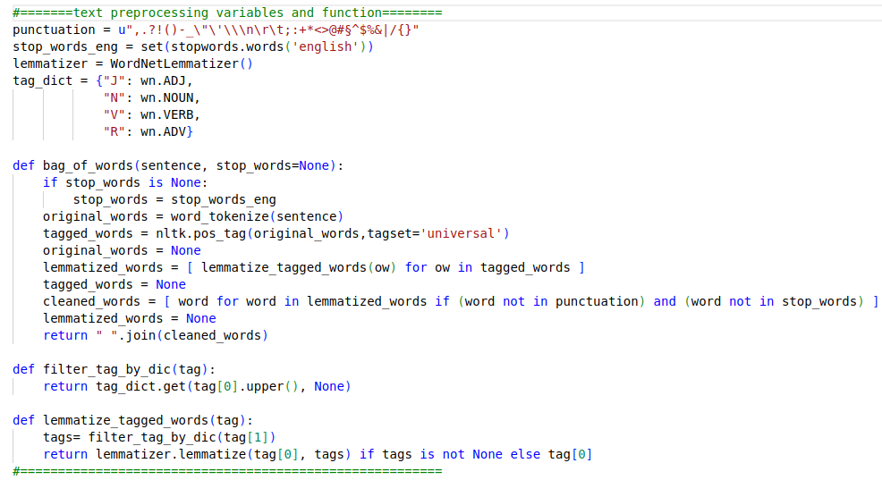

# SPAM DETECTION BY USING NLP
This is a fullstack project. This is useful to detect spam e-mail. This pproject was built by using Flask. So that, when you test on your own machine, it will work on localhost if you use default settings. 

When you clone to your own machine, you just need to run main.py

## <u>Basics</u>
Spam e-mail detection is a classification problem. As you know e-mail is a text. We need to convert texts into a format that computers can understand and manipulate. By using Natural Language Process it has changed from text to string. 

Due to the nature of supervised learning, you need a labeled dataset to solve the classification problem. 
According to number of each words that is labeled spam or ham, you can classify your text is spam or ham.

### <u>Texp Pre-Process</u>
<p align="left">
  
</p>

### <u>Tokenizer and Vectorizer</u>
```
cv=CountVectorizer() // in ML_Controller.py
cleaned_token_mail=cv.transform([cleaned_mail]) // in pages.py
```

### <u>Prediction</u>
The prediction value was obtained by using test and train data of the dataset. 
```
y_pred = model.predict(X_test) //in ML_Controller.py
pred_email=model.predict(cleaned_token_mail) // in pages.py 
```

## <u>Pickle</u>
Pickle is useful to save values of ML_Controller.py 

## <u>Run App</u>
```
$ python3 main.py
open localhost:5000
```
